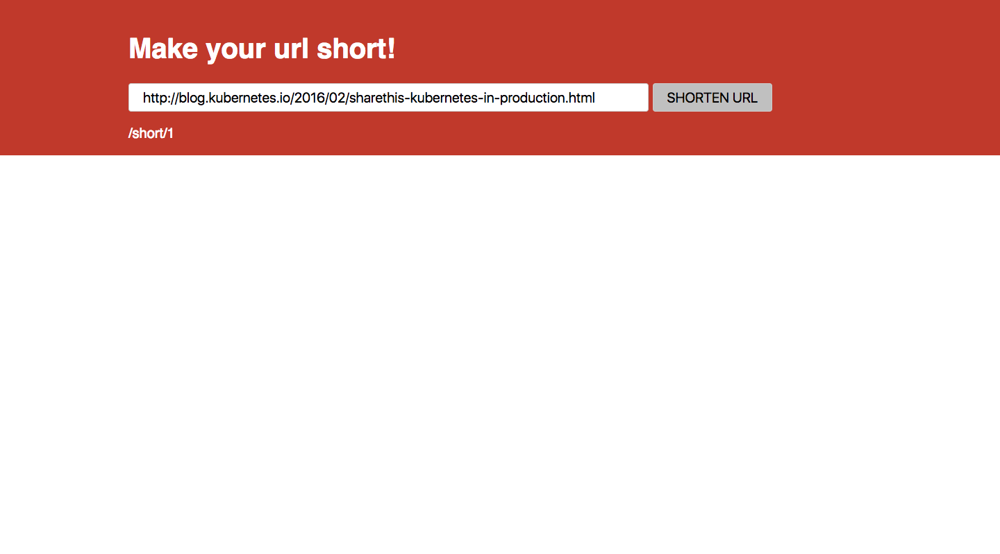

## Simple url shortener web service.
### Basic usage

Just post some JSON to your <hostname>/url (for me this is [http://localhost/url](http://localhost/url)). For example, below I post ```JSON
{"url": "hello/world!"}``` to [http://localhost/url](http://localhost/url):

```HTTP
POST /url HTTP/1.1
Accept: application/json, */*
Accept-Encoding: gzip, deflate
Connection: keep-alive
Content-Length: 22
Content-Type: application/json
Host: localhost
User-Agent: HTTPie/0.9.6

{
    "url": "helloworld!"
}

HTTP/1.1 200 OK
Allow: GET, HEAD, POST
Content-Length: 123
Content-Type: application/json
Date: Thu, 27 Oct 2016 19:03:42 GMT
Server: CherryPy/8.1.2

{
    "url": "helloworld!",
    "urlcode": "7",
    "urlcode-api": "http://localhost/url/7",
    "urlcode-link": "http://localhost/short/7"
}
```

This returns the original url you sent, a urlcode and urlcode-api that corresponds to this url and its address (for api usage), and finally a shortened url for sharing with others (urlcode-link).

Then we can get the resource by following the "urlcode-api" link in the response [http://localhost/url/7](http://localhost/url/7):

```HTTP
GET /url/7 HTTP/1.1
Accept: */*
Accept-Encoding: gzip, deflate
Connection: keep-alive
Host: localhost
User-Agent: HTTPie/0.9.6


HTTP/1.1 200 OK
Allow: GET, HEAD, POST
Content-Length: 123
Content-Type: application/json
Date: Thu, 27 Oct 2016 19:04:37 GMT
Server: CherryPy/8.1.2

{
    "url": "helloworld!",
    "urlcode": "7",
    "urlcode-api": "http://localhost/url/7",
    "urlcode-link": "http://localhost/short/7"
}
```

It also has a JSON error handler:

```HTTP
GET /url/doesnt/exist! HTTP/1.1
Accept: */*
Accept-Encoding: gzip, deflate
Connection: keep-alive
Host: localhost
User-Agent: HTTPie/0.9.6


HTTP/1.1 404 Not Found
Allow: GET, HEAD, POST
Content-Length: 1367
Content-Type: application/json
Date: Thu, 27 Oct 2016 15:46:55 GMT
Server: CherryPy/8.1.2

{
    "message": [
        "Nothing matches the given URI"
    ],
    "status": "404 Not Found",
    "traceback": "Traceback (most recent call last):\n  File \"/usr/lib/python3.5/site-packages/cherrypy/_cpdispatch.py\", line 60, in __call__\n    return self.callable(*self.args, **self.kwargs)\nTypeError: GET() takes from 1 to 2 positional arguments but 3 were given\n\nDuring handling of the above exception, another exception occurred:\n\nTraceback (most recent call last):\n  File \"/usr/lib/python3.5/site-packages/cherrypy/_cprequest.py\", line 670, in respond\n    response.body = self.handler()\n  File \"/usr/lib/python3.5/site-packages/cherrypy/lib/encoding.py\", line 220, in __call__\n    self.body = self.oldhandler(*args, **kwargs)\n  File \"/usr/lib/python3.5/site-packages/cherrypy/lib/jsontools.py\", line 61, in json_handler\n    value = cherrypy.serving.request._json_inner_handler(*args, **kwargs)\n  File \"/usr/lib/python3.5/site-packages/cherrypy/_cpdispatch.py\", line 66, in __call__\n    raise sys.exc_info()[1]\n  File \"/usr/lib/python3.5/site-packages/cherrypy/_cpdispatch.py\", line 64, in __call__\n    test_callable_spec(self.callable, self.args, self.kwargs)\n  File \"/usr/lib/python3.5/site-packages/cherrypy/_cpdispatch.py\", line 161, in test_callable_spec\n    raise cherrypy.HTTPError(404)\ncherrypy._cperror.HTTPError: (404, None)\n",
    "version": "8.1.2"
}
```

Definately consider taking the traceback for production...

A very basic web application using the
[CherryPy](http://cherrypy.org/) framework and Python 3.5.

The image is quite light thanks to
[Alpine Linux](https://hub.docker.com/r/frolvlad/alpine-python3/).


Run it
======

Clone and then cd into the repo, then run and build it using docker-compose:

```
$ docker-compose up --build
```

You can then point your browser to `http://locahost` and you should see something like this:


